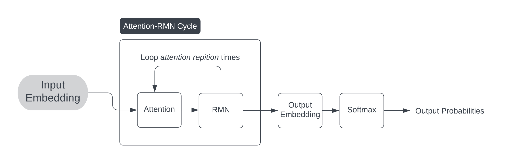

# Orca Engine

Orca is a family of AI model architechures based off the Transformers architechure.

## How it works

### Input Embedding

We use a dictionary matching words to their embeddings in 1228 dimensional tensors.

### Attention

We use self-attention to model the relationships between words. A more in-depth description can be found [here](https://proceedings.neurips.cc/paper_files/paper/2017/file/3f5ee243547dee91fbd053c1c4a845aa-Paper.pdf).

### RMN

The RMN (Refinement Matrix Network) layer is a new approach to the architechure. It is a neural network with each node having a matrix instead of a floating point number. It is used to refine possibly incorrect grammar.

### Output Embedding

We use a matrix to generate the output embedding.

## Training

To train on text data, we get the data with the last word removed, and pass it through the model. If it gets the correct word, we increase the score by 1.
After training on all the data, the points are divided by the total amount of text data. This is the accuracy of the model.

We improve the best models and discard the rest in the process, leaving (hopefully) a perfect or near perfect model.
